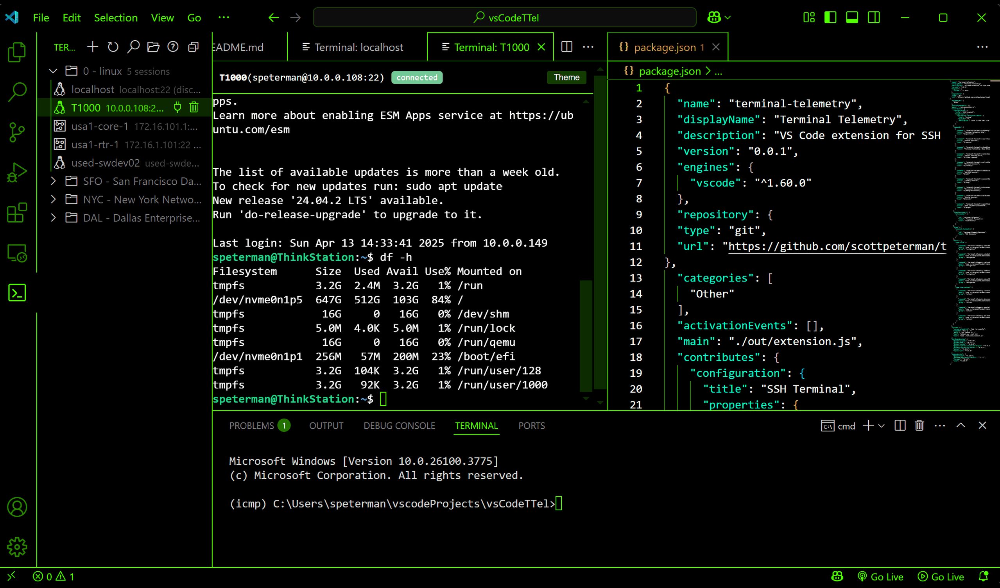

# Terminal Telemetry: VS Code SSH Session Manager

A powerful Visual Studio Code extension for managing and organizing SSH connections with advanced terminal features.


## Features


### Session Management
- **Organized Sessions**: Group your SSH connections into folders for easy management
- **YAML Configuration**: Load and switch between different session configuration files
- **Search Functionality**: Quickly filter through large session lists to find what you need
- **First-Class Citizen Terminals**: Sessions open in editor tabs, not in the lower terminals pane

### Connection Features
- **Secure SSH Connections**: Connect to remote servers via SSH with username/password authentication
- **Multiple Connections**: Connect to the same server with different credentials simultaneously
- **Connection Status**: Visual indicators show connection status (connected, disconnected, error)
- **Device Type Icons**: Different icons based on device type (Linux, Cisco, HP/Aruba)

### Terminal Experience
- **Custom Themes**: Personalize your terminal experience with multiple terminal color themes
- **Theme Switching**: Change terminal themes on-the-fly without restarting your connection
- **VS Code Theme Integration**: Match your terminal to your VS Code theme

### User Experience
- **Welcome Screen**: Helpful introduction and getting started guide for new users
- **Session Search**: Filter your session list for quick access in large environments
- **Context Menu Actions**: Easily manage sessions with right-click menus
- **Detailed Session Info**: Tooltips provide additional session details

## Installation

1. Install the extension from the VS Code Marketplace
2. Open the Terminal Telemetry view in the Activity Bar
3. Click the folder icon to select a sessions YAML file or create a new one

## Session Configuration

The extension uses YAML files to store session configurations. Here's a sample structure:

```yaml
- folder_name: Network Devices
  sessions:
    - display_name: Core Router
      host: 192.168.1.1
      port: 22
      DeviceType: cisco_ios
      credsid: 1

- folder_name: Linux Servers
  sessions:
    - display_name: Production Server
      host: prod.example.com
      port: 22
      DeviceType: linux
      credsid: 2
```

## Commands

The extension provides several commands to help you manage your SSH sessions:

- **Terminal Telemetry: Select Sessions File** - Choose a YAML file containing session definitions
- **Terminal Telemetry: Search Sessions** - Filter the session list
- **Terminal Telemetry: Add SSH Session** - Create a new session
- **Terminal Telemetry: Connect Session** - Connect to a selected session
- **Terminal Telemetry: Disconnect Session** - End an active connection
- **Terminal Telemetry: Delete Session** - Remove a session from configuration

## Requirements

- Visual Studio Code 1.60.0 or higher
- OpenSSH compatible SSH client installed on your system

## Extension Settings

This extension contributes the following settings:

* `sshTerminal.sessionsFilePath`: Path to the YAML file containing SSH session information

## License

This project is licensed under the MIT License - see the LICENSE file for details.


# UUID-Based SSH Terminal Architecture

This document describes the architecture of the VS Code SSH Terminal extension, which uses a UUID-based session management system to ensure reliable communication between components, support multiple simultaneous connections, and provide comprehensive debugging capabilities.

## Table of Contents

1. [Architecture Overview](#architecture-overview)
2. [Component Responsibilities](#component-responsibilities)
3. [UUID-Based Session Management](#uuid-based-session-management)
4. [Message Protocol](#message-protocol)
5. [Connection Flow](#connection-flow)
6. [Event Handling](#event-handling)
7. [Debugging Support](#debugging-support)
8. [Future Enhancements](#future-enhancements)

## Architecture Overview

The extension follows a modular architecture with clear separation of concerns:

```
┌────────────────┐     ┌─────────────────┐     ┌───────────────┐     ┌───────────────┐
│ SessionManager │◄───►│ WebviewManager  │◄───►│ SSHManager    │◄───►│ Terminal UI   │
└────────────────┘     └─────────────────┘     └───────────────┘     └───────────────┘
        ▲                      ▲                       ▲                     ▲
        │                      │                       │                     │
        └──────────────────────┴───────────────────────┴─────────────────────┘
                                 Session UUID Flow
```

## Component Responsibilities

### SessionManager
- Stores and manages session metadata
- Handles session persistence (YAML files)
- Manages folder and session hierarchies
- Retrieves credentials when needed

### WebviewManager
- Creates and manages terminal UI panels
- Routes messages between UI and SSHManager
- Manages panel lifecycle and visibility

### SSHManager
- Establishes and maintains SSH connections
- Processes terminal input/output
- Manages connection state
- Handles SSH protocol features

### Terminal UI
- Renders interactive terminal interface
- Processes user input
- Displays connection status
- Provides diagnostic features

## UUID-Based Session Management

Every SSH session is assigned a unique UUID that is used consistently across all components. This UUID-based approach provides several key benefits:

1. **Prevents Collision**: Multiple connections to the same host can exist simultaneously
2. **Scales Horizontally**: Supports any number of concurrent sessions
3. **Improves Debugging**: Allows for clear session tracing through logs
4. **Ensures Message Routing**: All messages are properly directed to the correct session

## Message Protocol

All communication between components uses a standardized message format:

```typescript
interface Message {
    sessionId: string;        // UUID of the session
    type: MessageType;        // Type of message
    payload: any;             // Message data
    timestamp: number;        // Message creation time
}
```

### Message Types

#### From Frontend to Backend
- **init**: Initial handshake when terminal UI loads
- **connect**: Request to establish SSH connection with provided config
- **input**: Terminal input (keystrokes)
- **resize**: Terminal dimension changes
- **disconnect**: User-initiated disconnect
- **ping**: Health check
- **diagnostic**: Request for diagnostic information

#### From Backend to Frontend
- **output**: Terminal output data
- **connectionStatus**: Connection state updates
- **error**: Error messages for display
- **metadata**: Session information updates
- **diagnostic**: Debug information
- **pong**: Health check response

### Legacy Message Support

For backward compatibility, the system also supports legacy messages with the format:

```typescript
interface LegacyMessage {
    command: string;          // Command type
    data?: any;               // Command data
    // Other fields specific to command
}
```

## Connection Flow

### Startup Process

1. **Extension Activation**
   - `extension.ts` activates and initializes core components
   - Session data is loaded from YAML files
   - UI tree view is populated with available sessions

2. **Session Connection Initiation**
   - User clicks on a session in the tree view
   - `SessionManager.connectSession()` is called with session ID
   - Credentials are retrieved (from keychain or user input)
   - `WebviewManager.openTerminalWithSSH()` is called with session ID and connection config

3. **Terminal Panel Creation**
   - WebviewManager creates a new webview panel
   - HTML content with xterm.js is loaded
   - SSHManager instance is created with the session ID
   - Terminal initialization begins

### Terminal Initialization and Connection

1. **Terminal UI Initialization**
   - Terminal UI loads and initializes xterm.js
   - Terminal sends `init` message with dimensions to WebviewManager
   - WebviewManager forwards `init` to SSHManager for dimension setup
   - WebviewManager sends `connect` message with connection parameters

2. **SSH Connection Establishment**
   - SSHManager receives `connect` message with connection config
   - SSH connection is attempted with provided parameters
   - Connection status updates are sent to Terminal UI
   - Once connected, shell session is opened

3. **Data Exchange**
   - User input: Terminal UI → `input` message → SSHManager → SSH connection
   - Server output: SSH connection → SSHManager → `output` message → Terminal UI

### Disconnection Process

1. **User-Initiated Disconnect**
   - User closes panel or clicks disconnect
   - Terminal UI → `disconnect` message → SSHManager → close connection
   - Resources are cleaned up and status is updated

2. **Remote-Initiated Disconnect**
   - SSH server closes connection
   - SSHManager detects closure → sends `connectionStatus` message
   - Terminal UI updates to show disconnected state

## Event Handling

### SSH Connection Events

The SSHManager subscribes to these SSH events:
- **ready**: Connection established successfully
- **error**: Connection error occurred
- **close**: Connection closed
- **end**: SSH stream ended
- **handshake**: SSH handshake completed

### Terminal Events

The Terminal UI handles these events:
- **onData**: User input received
- **onResize**: Terminal dimensions changed
- **window.resize**: Browser window resized

## Debugging Support

The architecture includes comprehensive diagnostic capabilities:

1. **Session Tracing**
   - All log messages include the session UUID
   - Each component logs its operations with appropriate severity

2. **Diagnostic Commands**
   - Terminal UI can request diagnostics with the `diagnostic` message
   - SSHManager reports detailed connection state
   - Communication statistics are tracked and displayed

3. **Error Recovery**
   - Graceful handling of connection failures
   - Automatic cleanup of resources when disconnection occurs
   - Structured error reporting to the user interface

## Future Enhancements

Potential improvements to the architecture include:

1. **Message Sequence Numbers**
   - Add sequence numbers to detect out-of-order messages
   - Implement basic acknowledgment for critical commands

2. **Connection Health Monitoring**
   - Add regular ping/pong health checks
   - Detect and recover from stalled connections

3. **Session Persistence**
   - Support for session state preservation across VS Code restarts
   - Automatic reconnection capability

4. **Protocol Extensions**
   - Support for SCP/SFTP file transfers
   - Port forwarding capabilities
   - Multiple simultaneous shells within one connection

---

## Release Notes – Version 0.1.3

### SSH Compatibility Fixes
- Resolved several issues related to SSH authentication and terminal startup.
- Improved handling of devices with non-standard SSH behavior.
- Tested across Cisco IOS, Cisco NX-OS, Arista EOS, Ubuntu 22.04, and RHEL 9.5.

### Terminal Theming per Tab
- Terminal panes now support independent theme selection during an active session.
- Useful for distinguishing between multiple open sessions.

### Session Editor (Early Preview)
- Introduced a graphical editor for existing session YAML files.
- Sessions are organized by folder and editable through a form-based interface.
- Current support is limited to editing existing sessions. Add/delete functionality will be added in a future release.

### Webview Debugging
- Added Eruda developer console to terminal and editor webviews.
- Enables inspection and real-time debugging of JavaScript in environments where standard devtools are unavailable.

---
